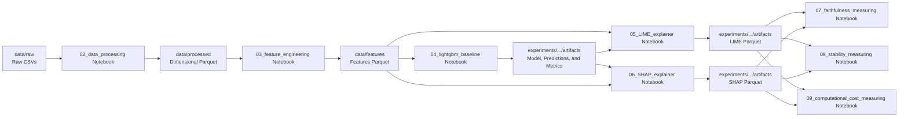

# Execution Flow

## Effective Pipeline

## Required Order

1. `02_data_processing.ipynb` generates the Parquet tables in `data/processed/`.
2. `03_feature_engineering.ipynb` generates `data/features/features.parquet`.
3. `04_lightgbm_baseline.ipynb` generates the baseline model artifacts.
4. `05_LIME_explainer.ipynb` and `06_SHAP_explainer.ipynb` can run independently after the baseline.
5. `07_faithfulness_measuring.ipynb`, `08_stability_measuring.ipynb`, and `09_computational_cost_measuring.ipynb` run after the baseline, LIME, and SHAP explanations are persisted.

## Inputs and Outputs

| Stage | Inputs | Persisted outputs |
|---|---|---|
| Processing | Three M5 CSVs | Five dimensional/fact parquet files. |
| Feature engineering | Processed parquet tables | One feature parquet file. |
| Baseline | Parquet file with features | Pickled model, holdout predictions, metrics JSON, and feature importance. |
| LIME | Features, model, and predictions | Parquet with LIME sample rows and local explanations. |
| SHAP | Features, model, and predictions | Parquet with SHAP sample rows, local explanations, and metrics JSON. |
| Faithfulness | Model, features, holdout predictions, LIME/SHAP explanations | `faithfulness_deletion_results.parquet`, `faithfulness_metric_curve.parquet`, `faithfulness_metrics.json`. |
| Stability | Model, features, LIME/SHAP explanations | `stability_results.parquet`, `stability_metrics.json`. |
| Computational Cost | Model, features, sample rows | `computational_cost_results.parquet`, `computational_cost_metrics.json`, `fig_computational_cost_comparison.png`. |

The notebooks use relative paths and assume `notebooks/` as their working directory. When run elsewhere, their paths must be adjusted.

