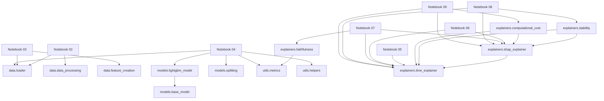

# Module Dependencies

## Internal Graph

## Module Responsibilities

| Module | Responsibility | Internal dependencies |
|---|---|---|
| `data.loader` | Reads CSV and Parquet files. | None. |
| `data.data_processing` | Optimizes memory and creates processed tables. | None. |
| `data.feature_creation` | Consolidates data and creates temporal features. | None. |
| `models.base_model` | Defines the abstract model interface (`BaseModel`). | None. |
| `models.lightgbm_model` | Trains, predicts, and extracts LightGBM importance. | `models.base_model`. |
| `models.splitting` | Performs temporal train/holdout splitting and feature/target separation. | None. |
| `utils.metrics` | Provides RMSE, MAE, MAPE, RMSSE, WRMSSE, and aggregate evaluation. | None. |
| `utils.helpers` | Persists and loads objects with pickle. | None. |
| `explainers.lime_explainer` | Samples by error tail, encodes data, and generates parallel LIME explanations. | None. |
| `explainers.shap_explainer` | Generates TreeSHAP local explanations and validates additive reconstruction. | LIME utilities (`lime_explainer`). |
| `explainers.faithfulness` | Runs iterative-deletion faithfulness analysis, degradation curves, and summary metrics. | `src.utils.metrics`. |
| `explainers.stability` | Measures perturbation-based ranking stability ($\rho$) for LIME and SHAP. | LIME and SHAP utilities. |
| `explainers.computational_cost` | Benchmarks instance-level execution runtime ($s$) for LIME and SHAP. | LIME and SHAP utilities. |

There are no circular dependencies. SHAP intentionally reuses LIME utilities because both explainers operate on the same encoded feature space, artifact loading conventions, and deterministic error-based sampling. Stability and computational-cost modules also consume both explainers because they evaluate the two local attribution methods under identical conditions.

## Notebook Dependencies

- **Notebook 02** → `src.data.loader`, `src.data.data_processing`
- **Notebook 03** → `src.data.loader`, `src.data.feature_creation`
- **Notebook 04** → `src.data.loader`, `src.models.splitting`, `src.models.lightgbm_model`, `src.utils.metrics`, `src.utils.helpers`
- **Notebook 05** → `src.explainers.lime_explainer` and artifacts from Notebook 04
- **Notebook 06** → `src.explainers.shap_explainer`, `src.explainers.lime_explainer`, and artifacts from Notebook 04
- **Notebook 07** → `src.explainers.faithfulness`, `src.explainers.lime_explainer`, `src.explainers.shap_explainer`, and artifacts from Notebook 04
- **Notebook 08** → `src.explainers.stability`, `src.explainers.lime_explainer`, `src.explainers.shap_explainer`, and artifacts from Notebook 04
- **Notebook 09** → `src.explainers.computational_cost`, `src.explainers.lime_explainer`, `src.explainers.shap_explainer`, and artifacts from Notebook 04
