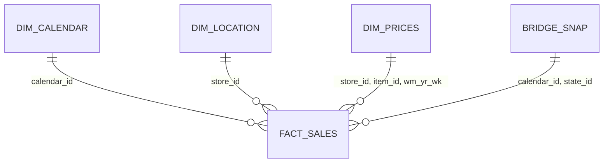

# Processed Data Schema

## Overview

`02_data_processing.ipynb` converts the raw M5 CSV files into Parquet tables
under `data/processed/`. The layout follows a lightweight star-schema design:
`fact_sales` is the central fact table, supported by calendar, location, price,
and SNAP tables.

## Tables

### `dim_calendar.parquet`

**Grain:** one row per M5 calendar day (`calendar_id`).

| Column | Description |
|---|---|
| `calendar_id` | M5 day identifier, derived from raw `d`. |
| `date` | ISO calendar date. |
| `wm_yr_wk` | M5 week identifier used to join prices. |
| `weekday`, `wday`, `month`, `year` | Calendar attributes. |
| `event_name_1`, `event_type_1`, `event_name_2`, `event_type_2` | Event attributes. |

### `dim_location.parquet`

**Grain:** one row per store.

| Column | Description |
|---|---|
| `store_id` | Store identifier. |
| `state_id` | State associated with the store. |

This table is derived by selecting and deduplicating `store_id` and `state_id`
from the sales source.

### `dim_prices.parquet`

**Grain:** one row per store, item, and M5 week.

| Column | Description |
|---|---|
| `store_id` | Store identifier. |
| `item_id` | Item identifier. |
| `wm_yr_wk` | M5 week identifier. |
| `sell_price` | Weekly selling price. |

### `bridge_snap.parquet`

**Grain:** one row per calendar day and state.

| Column | Description |
|---|---|
| `calendar_id` | M5 day identifier. |
| `state_id` | State code: `CA`, `TX`, or `WI`. |
| `is_snap` | State-specific SNAP indicator. |

The table is created by melting `snap_CA`, `snap_TX`, and `snap_WI` from the
raw calendar data.

### `fact_sales.parquet`

**Grain:** one row per store, item, and M5 calendar day.

| Column | Description |
|---|---|
| `store_id` | Store identifier. |
| `item_id` | Item identifier. |
| `dept_id` | Department identifier. |
| `cat_id` | Category identifier. |
| `calendar_id` | M5 day identifier. |
| `sales` | Observed unit sales. |

The processing step drops the raw `id` and `state_id` columns, then melts daily
sales columns into `calendar_id` and `sales`.

## Physical Storage and Types

Tables are stored as Parquet. Numeric values are downcast before persistence
when possible: sales and week identifiers are typically stored as compact
integers, while prices are typically stored as `float16`. Consumers should rely
on column meaning rather than an exact physical dtype, because the optimizer can
select a different safe representation when source values change.

## Join Rules

The feature-consolidation flow uses these joins:

1. `fact_sales` LEFT JOIN `dim_calendar` on `calendar_id`;
2. result LEFT JOIN `dim_prices` on `(store_id, item_id, wm_yr_wk)`;
3. result LEFT JOIN `dim_location` on `store_id`.
4. result LEFT JOIN `bridge_snap` on `(calendar_id, state_id)`.