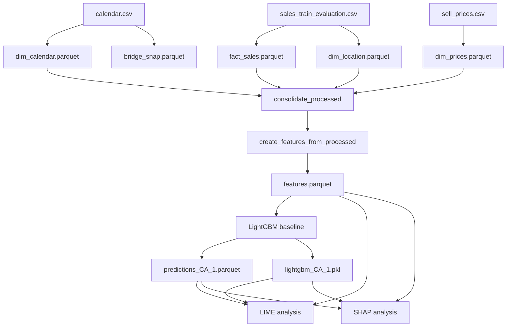

# Data Lineage

## End-to-End Lineage

## Transformation Steps

### 1. Raw to Processed

`02_data_processing.ipynb` calls `load_data_raw()` and materializes the
processed Parquet tables.

| Raw source | Transformation | Output |
|---|---|---|
| `calendar.csv` | Select and rename calendar columns. | `dim_calendar.parquet` |
| `calendar.csv` | Melt state SNAP columns and normalize state codes. | `bridge_snap.parquet` |
| `sell_prices.csv` | Select price key and measure columns. | `dim_prices.parquet` |
| `sales_train_evaluation.csv` | Deduplicate store/state pairs. | `dim_location.parquet` |
| `sales_train_evaluation.csv` | Drop redundant columns and melt daily columns to long form. | `fact_sales.parquet` |

### 2. Processed to Features

`03_feature_engineering.ipynb` loads the processed tables, 
and performs the four joins documented in
[Processed Data Schema](02_processed-schema.md). It then creates the composite
series identifier, parses dates, encodes events, and calculates calendar, lag,
and rolling features.

The result is saved as `data/features/features.parquet`.

### 3. Features to Baseline Artifacts

`04_lightgbm_baseline.ipynb` loads the feature dataset, encodes
model inputs, and makes a temporal train/validation/holdout split. It persists:

- a serialized model;
- holdout predictions;
- aggregate metrics;
- feature importance by gain and split count.

### 4. Baseline Artifacts to Explanations

The LIME and SHAP notebooks load the saved model and holdout predictions, join
the selected cases back to the feature dataset on `(id, date)`, and persist
explanation results. They also compare a fresh model prediction with the saved
prediction as a consistency check.