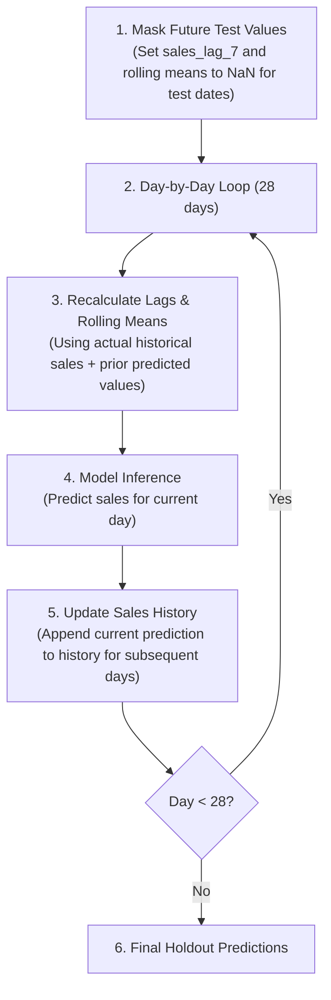

# Temporal Validation Strategy

## Rationale

Demand forecasting models require evaluation schemes that simulate realistic deployment scenarios. Standard $K$-fold cross-validation is inappropriate for time-series forecasting because random shuffling causes data leakage from future observations to past observations.

This project implements a **strict temporal validation split** based on a historical cutoff date (`2016-04-24`), reserving post-cutoff observations as an out-of-time holdout evaluation set.

## Split Structure and Data Allocation

The dataset for store `CA_1` contains daily observations spanning from `d_1` (`2011-01-29`) through `d_1941` (`2016-05-22`). The temporal allocation is structured as follows:

```mermaid
flowchart LR
    subgraph Full Time Series (CA_1)
        direction LR
        TrainPart["Training Subset\n(5,661,993 rows)\n2011-01-29 to 2016-03-27"] --> ValPart["Validation Set (28 days)\n(85,372 rows)\n2016-03-28 to 2016-04-24"]
        ValPart --> Holdout["Holdout Set (28 days)\n(85,372 rows)\n2016-04-25 to 2016-05-22"]
    end
```

### Breakdown of Sets:

1. **Training Set (`train_df`)**:
   - Condition: `date <= '2016-04-24'`
   - Total rows: **5,747,365**
2. **Validation Set (`X_val`, `y_val`)**:
   - Condition: Final 28 days of training data (`2016-03-28` to `2016-04-24`)
   - Total rows: **85,372**
   - Purpose: Early stopping and hyperparameter monitoring for LightGBM.
3. **Training Subset (`X_train`, `y_train`)**:
   - Condition: `date < '2016-03-28'`
   - Total rows: **5,661,993**
   - Purpose: Model fitting.
4. **Holdout Evaluation Set (`X_holdout`, `y_holdout`)**:
   - Condition: `date > '2016-04-24'`
   - Total rows: **85,372** (28 days $\times$ 3,049 items for `CA_1`)
   - Purpose: Final out-of-time performance measurement and xAI explanation sampling.

## Implementation Details

Data splitting functions are encapsulated in `src/models/splitting.py`:

- `split_train_holdout(df, split_date)`: Divides DataFrame into historical training/validation (`<= split_date`) and holdout evaluation (`> split_date`).
- `split_features_target(df, target_col='sales', drop_cols=None)`: Separates model feature matrix $X$ from target vector $y$, removing non-feature metadata columns (`id`, `date`, `d`, `sales`).

## Multi-Step Recursive Forecasting & Leakage Prevention

In multi-step time-series forecasting, lag and rolling features can cause lookahead data leakage if future actual sales in the holdout period are accessed directly. 

To eliminate data leakage, the baseline evaluation in `notebooks/04_lightgbm_baseline.ipynb` enforces **dynamic recursive forecasting**:



1. **Test Feature Masking**: Initial values of `rolling_mean_7`, `rolling_mean_28`, and `sales_lag_7` (beyond day 7) are masked with `NaN` in `X_test`.
2. **Iterative Dynamic Recalculation**: For each date $t \in [\text{2016-04-25}, \text{2016-05-22}]$:
   - `sales_lag_7` is fetched from `sales_history` ($t - 7\text{ days}$). For $t \ge \text{2016-05-02}$, this uses previously predicted values $\hat{y}$.
   - `rolling_mean_7` and `rolling_mean_28` are computed dynamically over all sales prior to $t$ in `sales_history` (combining real history and previously predicted sales).
3. **Recursive Autoregression**: The model prediction $\hat{y}_t$ is appended to `sales_history`, propagating forward to inform subsequent time steps $t+1, \dots, t+28$.

This ensures that the out-of-time evaluation strictly reflects real-world operational conditions with **zero future ground-truth leakage**.

## Related Documentation

- [Architecture Decisions](../01_architecture/04_decisions.md)
- [LightGBM Baseline Model](01_lightgbm-baseline.md)
- [Module Reference: `src.models.splitting`](../09_reference/models/03_splitting.md)
