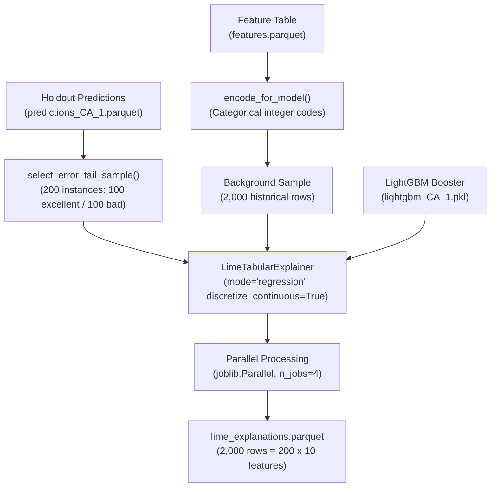

# LIME Local Explanations

## Overview

LIME (Local Interpretable Model-agnostic Explanations) builds local linear surrogate models around individual predictions to explain the behavior of complex machine learning models. In this project, LIME is applied to explain the predictions of the baseline LightGBM model for store `CA_1`.

The implementation is encapsulated in `src/explainers/lime_explainer.py` and executed via `notebooks/05_LIME_explainer.ipynb`.

## LIME Workflow and Architecture



## Key Functions (`src/explainers/lime_explainer.py`)

- **`encode_for_model(df)`**: Converts string and boolean columns into integer codes compatible with LightGBM and LIME, returning categorical mappings.
- **`build_lime_explainer(background_data, feature_names, ...)`**: Instantiates a `LimeTabularExplainer` with continuous feature discretization enabled.
- **`explain_lime_sample(model, sample_frame, background_frame, ...)`**: Generates LIME explanations across sampled rows in parallel using `joblib.Parallel(n_jobs=4)`.
- **`save_lime_explanations(explanations, output_path)`**: Persists output DataFrames to Parquet format.

## Configuration Parameters (`LimeRunConfig`)

```python
@dataclass(frozen=True)
class LimeRunConfig:
    sample_size: int = 200
    background_size: int = 2000
    num_features: int = 10
    random_state: int = 42
    n_jobs: int = 4
```

- **`sample_size`**: 200 total instances (100 low-error `excellent` + 100 high-error `bad`).
- **`background_size`**: 2,000 historical training rows (`date <= '2016-04-24'`) used to estimate feature distributions.
- **`num_features`**: Top 10 most influential features extracted per instance.

## Output Schema (`lime_explanations.parquet`)

The long-form output table contains 2,000 rows (200 instances $\times$ 10 top features):

| Column | Type | Description |
|---|---|---|
| `row_index` | `int64` | Index of the target instance (0 to 199). |
| `id`, `date` | `string`, `datetime64` | Time-series identifier and date. |
| `actual_sales`, `pred_saved` | `float64` | Ground truth unit sales and model prediction. |
| `residual`, `abs_error` | `float64` | Error metrics ($y - \hat{y}$ and $|y - \hat{y}|$). |
| `sample_bucket` | `string` | Error classification (`excellent` or `bad`). |
| `feature_name` | `string` | Name of the feature. |
| `feature_value` | `float64` | Raw value of the feature for the instance. |
| `feature_display_value` | `string` | Human-readable value (e.g., category string). |
| `weight` | `float64` | LIME linear surrogate coefficient (local feature impact). |
| `feature_rank` | `int64` | Rank of importance for this instance (1 to 10). |
| `intercept` | `float64` | Intercept of the local LIME linear surrogate model. |

## Related Documentation

- [Error-Tail Sampling Strategy](03_sampling-by-error.md)
- [SHAP Local Explanations](02_shap.md)
- [Notebook 05: LIME Explainer](../04_notebooks/05_lime-explainer.md)
- [Module Reference: `src.explainers.lime_explainer`](../09_reference/explainers/01_lime-explainer.md)
