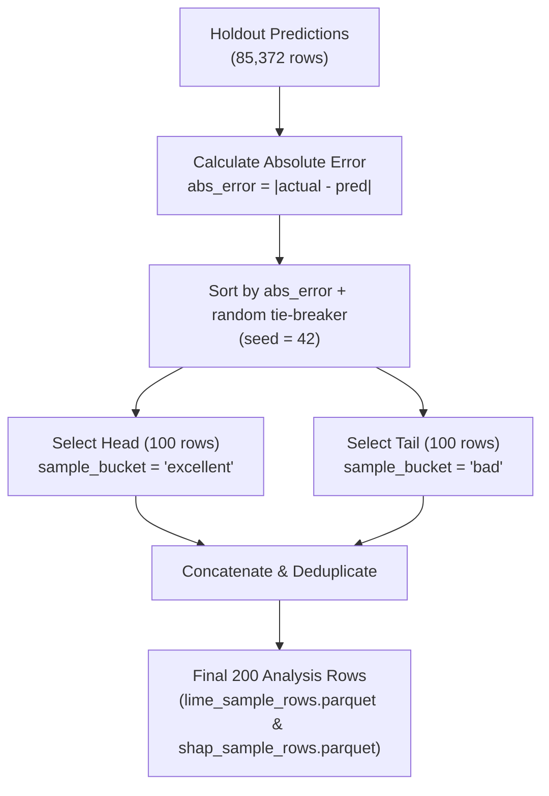

# Error-Tail Sampling Strategy

## Rationale

In retail demand forecasting, time-series datasets contain millions of observations dominated by typical low-demand or zero-demand days. Randomly sampling instances for xAI evaluation yields mostly average cases and obscures critical model behaviors during prediction failures.

To address this, this project implements **Error-Tail Sampling** (`select_error_tail_sample()` in `src/explainers/lime_explainer.py`). The strategy selects a deterministic sample concentrated at the two extremes of prediction accuracy:
1. **Best Predictions (`excellent`)**: Cases with the lowest absolute prediction errors.
2. **Worst Predictions (`bad`)**: Cases with the highest absolute prediction errors.

Contrasting explanations between these two groups reveals why the model succeeds or fails in specific demand regimes (e.g., stockouts, promotions, or demand spikes).

## Selection Algorithm

### Steps:

1. **Error Calculation**: Compute residual and absolute error for each holdout instance:
   $$\text{abs\_error} = |y_{\text{actual}} - \hat{y}_{\text{pred}}|$$
2. **Deterministic Tie-Breaking**: Assign a random tie-breaker column `_tie_breaker` generated with a fixed seed (`seed=42`) to guarantee reproducibility.
3. **Sort**: Sort all holdout rows ascending by `[abs_error, _tie_breaker, id, date]`.
4. **Low-Error Tail (`excellent`)**: Take the top $N/2 = 100$ rows with smallest absolute error. Assign `sample_bucket = 'excellent'` and `sample_rank` from 1 to 100.
5. **High-Error Tail (`bad`)**: Take the top $N/2 = 100$ rows with largest absolute error. Assign `sample_bucket = 'bad'` and `sample_rank` from 1 to 100.
6. **Consolidation**: Combine low and high tails, remove potential duplicate indices, and sort output rows deterministically.

## Sample Composition (`exp_001_baseline_lgbm`)

For the baseline experiment on store `CA_1`:

| Sample Bucket | Count | Mean Absolute Error | Error Range |
|---|---:|---:|---|
| **`excellent`** | 100 | $< 0.001$ units | $[0.0000, 0.0021]$ units |
| **`bad`** | 100 | $> 19.9$ units | $[19.96, 45.12]$ units |
| **Total** | **200** | — | — |

## Shared Sampling Alignment

Both LIME (Notebook 05) and SHAP (Notebook 06) consume the identical sample produced by `select_error_tail_sample(seed=42)`. This alignment enables direct instance-by-instance comparison between LIME and SHAP feature attributions across both low-error and high-error scenarios.

## Related Documentation

- [LIME Local Explanations](01_lime.md)
- [SHAP Local Explanations](02_shap.md)
- [XAI Evaluation Protocol](04_evaluation-protocol.md)
