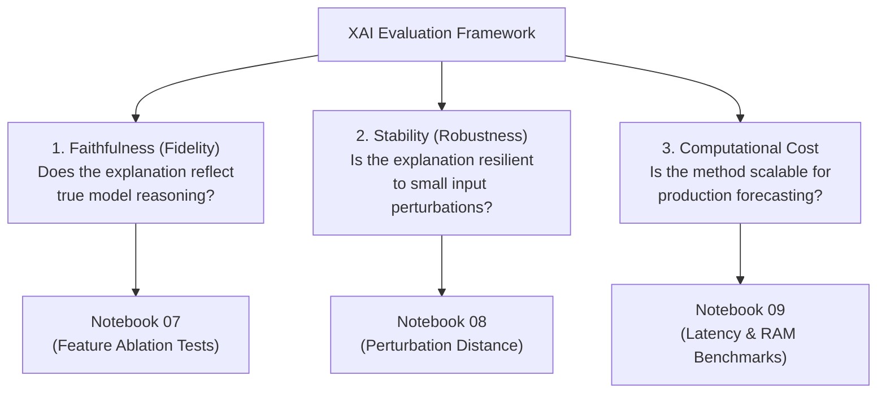

# XAI Evaluation Protocol

## Overview

A critical objective of this project is to evaluate the quality, reliability, and computational efficiency of local explanation methods (LIME and SHAP) when applied to retail demand forecasting models.

Rather than assuming explanation correctness, the evaluation framework assesses explanations along three core dimensions: **Faithfulness**, **Stability**, and **Computational Cost**.

## Evaluation Dimensions

### 1. Faithfulness (Fidelity)

- **Definition**: The degree to which an explanation's feature importance weights accurately reflect the underlying predictive model's internal feature dependencies.
- **Evaluation Method**: Iterative feature deletion (ablation) tests. Sequentially remove top-ranked features identified by LIME vs. SHAP and observe the increase in prediction error (RMSE and WRMSSE). Higher fidelity methods exhibit steeper error degradation when top features are masked.
- **Notebook**: `notebooks/07_faithfulness_measuring.ipynb`.
- **Module**: `src.explainers.faithfulness`.

### 2. Stability (Robustness)

- **Definition**: The consistency of local explanations when small, controlled perturbations are introduced to continuous input features.
- **Evaluation Method**: Perturbation testing. Add 3% Gaussian noise ($\eta = 0.03 \cdot \sigma_j$) to continuous features while preserving categorical variables on the valid data manifold. Re-generate explanations and compute the **Spearman Rank Correlation Coefficient** ($\rho$) between baseline and perturbed feature attributions.
- **Notebook**: `notebooks/08_stability_measuring.ipynb`.
- **Module**: `src.explainers.stability`.

### 3. Computational Cost (Efficiency)

- **Definition**: The computational overhead (wall-clock latency in seconds) required to compute local explanations.
- **Evaluation Method**: Instance-level latency profiling. Measure per-instance runtime with high-precision `Timer` across the 200 holdout instances for SHAP Local (TreeExplainer) and LIME Local (linear surrogate).
- **Notebook**: `notebooks/09_computational_cost_measuring.ipynb`.
- **Module**: `src.explainers.computational_cost`.

## Comparative Evaluation Plan

The protocol evaluates LIME and SHAP comparatively across both error tails (`excellent` vs. `bad` prediction error buckets):

| Dimension | Metric | Evaluation Goal |
|---|---|---|
| **Faithfulness** | $\Delta\text{RMSE}$, $\Delta\text{WRMSSE}$, $\text{AUC}_{\text{degradation}}$ upon top-feature deletion | Verify which method better identifies truly influential features. |
| **Stability** | Spearman Rank Correlation ($\rho$) across perturbed inputs | Determine robustness to input noise and variance. |
| **Cost** | Mean seconds / instance and runtime dispersion | Assess operational feasibility for real-time and batch pipelines. |

## Related Documentation

- [Error-Tail Sampling Strategy](03_sampling-by-error.md)
- [LIME Local Explanations](01_lime.md)
- [SHAP Local Explanations](02_shap.md)
- [Notebook 07: Faithfulness Measuring](../04_notebooks/07_faithfulness-measuring.md)
- [Notebook 08: Stability Measuring](../04_notebooks/08_stability-measuring.md)
- [Notebook 09: Computational Cost Measuring](../04_notebooks/09_computational-cost-measuring.md)
