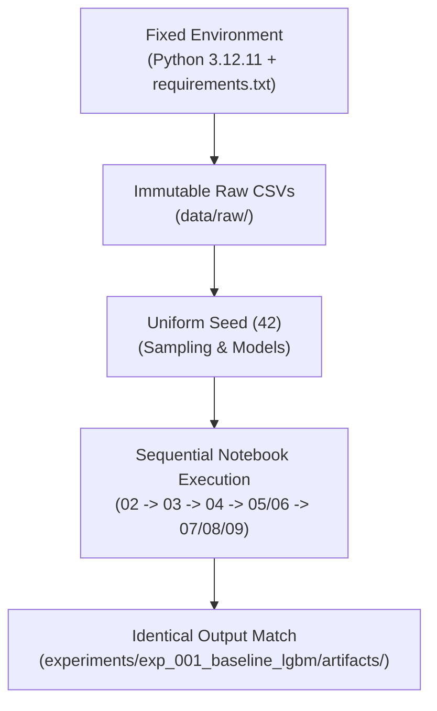

# Reproducibility Guide

## Overview

Ensuring 100% deterministic reproducibility across data transformation, model training, error-tail sampling, and explanation generation is a core requirement of this research project.

This document outlines the controls and fixed configurations required to replicate the reference experiment `exp_001_baseline_lgbm`.

## Reproducibility Controls

### 1. Fixed Environment & Dependencies
- **Python Version**: Python 3.12.11 (pinned in `.python-version`).
- **Exact Package Versions**: All library versions are explicitly pinned in `requirements.txt`.

### 2. Immutable Raw Data
- Source CSV files in `data/raw/` (`calendar.csv`, `sell_prices.csv`, `sales_train_evaluation.csv`) must remain unedited.

### 3. Uniform Random Seed Control
To eliminate stochastic variance across runs, the constant seed **`42`** is enforced across all components:
- **Error-Tail Sampling**: `select_error_tail_sample(..., seed=42)`
- **LIME Explainer**: `random_state=42`
- **SHAP Sampling**: `seed=42`
- **Background Sampling**: `background_frame.sample(n=2000, random_state=42)`
- **Faithfulness Deletion**: Deterministic ordering by absolute weight/Shapley magnitude.
- **Stability Continuous Perturbation**: `seed=42`, `noise_scale=0.03`.

### 4. Fixed Experiment Parameters (`exp_001_baseline_lgbm`)

| Parameter | Value | Description |
|---|---|---|
| `store_filter` | `'CA_1'` | Store evaluation scope. |
| `split_date` | `'2016-04-24'` | Cutoff date separating training/validation from holdout evaluation. |
| `sample_size` | `200` | Instances selected for explanation (100 `excellent`, 100 `bad`). |
| `background_size` | `2,000` | Historical training rows sampled for background distribution. |

## Verification of Reproducibility

When rerunning the pipeline, the generated output artifacts under `experiments/exp_001_baseline_lgbm/artifacts/` can be validated against the checked-in reference artifacts:

1. **Model Iteration**: LightGBM early stopping must land on **iteration 399**.
2. **Holdout Error**: Holdout RMSE must equal **2.1694**, MAE **1.1507**.
3. **Sample Alignment**: The 200 selected rows in `lime_sample_rows.parquet` and `shap_sample_rows.parquet` must contain identical `(id, date)` pairs.
4. **SHAP Additivity**: Max SHAP reconstruction delta in `shap_metrics_CA_1.json` must be $< 10^{-8}$.
5. **Faithfulness Output**: `faithfulness_metrics.json` contains 10 deletion steps for both LIME and SHAP with calculated AUC metrics.
6. **Stability Output**: `stability_metrics.json` contains aggregate Spearman correlations for overall, `excellent`, and `bad` buckets.
7. **Computational Cost Output**: `computational_cost_metrics.json` contains per-instance statistics for SHAP Local and LIME Local.

## Related Documentation

- [Environment and Installation Guide](01_environment-and-installation.md)
- [Artifact Catalog](03_artifact-catalog.md)
- [Runbook](04_runbook.md)
