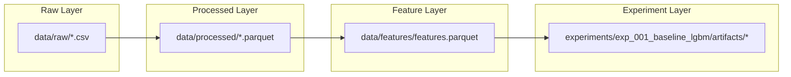

# Artifact Catalog

## Overview

This catalog documents all physical data, model, prediction, and explanation artifacts generated across the data pipeline and stored in the repository filesystem.

## Catalog Summary by Layer

## Detailed Artifact Specifications

### 1. Raw Data Layer (`data/raw/`)

| File Name | Format | Grain | Size / Description |
|---|---|---|---|
| `calendar.csv` | CSV | Day | 1,969 rows. Maps M5 day codes (`d_1`..`d_1969`) to dates, events, and SNAP flags. |
| `sell_prices.csv` | CSV | Store-item-week | 6,841,121 rows. Weekly selling price per store and item. |
| `sales_train_evaluation.csv` | CSV | Store-item series | 30,490 rows $\times$ 1,947 cols. Daily unit sales from `d_1` to `d_1941`. |

### 2. Processed Data Layer (`data/processed/`)

| File Name | Format | Rows | Key Schema Columns |
|---|---|---:|---|
| `dim_calendar.parquet` | Parquet | 1,969 | `calendar_id`, `date`, `wm_yr_wk`, `event_name_1`, `event_type_1`, ... |
| `dim_location.parquet` | Parquet | 10 | `store_id`, `state_id` |
| `dim_prices.parquet` | Parquet | 6,841,121 | `store_id`, `item_id`, `wm_yr_wk`, `sell_price` |
| `bridge_snap.parquet` | Parquet | 5,907 | `calendar_id`, `state_id`, `is_snap` |
| `fact_sales.parquet` | Parquet | 59,181,090 | `store_id`, `item_id`, `dept_id`, `cat_id`, `calendar_id`, `sales` |

### 3. Feature Data Layer (`data/features/`)

| File Name | Format | Rows | Cols | Description |
|---|---|---:|---:|---|
| `features.parquet` | Parquet | 59,181,090 | 25 | Consolidated analytical dataset containing hierarchy, calendar, SNAP indicator, price, lags (7, 28), and rolling means (7, 28). (5,918,109 rows when filtered for store `CA_1`). |

### 4. Experiment Artifacts (`experiments/exp_001_baseline_lgbm/artifacts/`)

| File Name | Format | Size/Rows | Description |
|---|---|---:|---|
| `lightgbm_CA_1.pkl` | Pickle | ~1.8 MB | Serialized trained LightGBM booster object. |
| `predictions_CA_1.parquet` | Parquet | 85,372 rows | Holdout predictions (`id`, `date`, `y_true`, `y_pred`). |
| `feature_importance_CA_1.parquet` | Parquet | 20 rows | Top 20 features ranked by gain importance (`feature`, `importance`). |
| `lime_sample_rows.parquet` | Parquet | 200 rows | Metadata for the 200 selected error-tail instances (LIME). |
| `lime_explanations.parquet` | Parquet | 2,000 rows | Long-form LIME local feature weights (200 instances $\times$ 10 features). |
| `shap_sample_rows.parquet` | Parquet | 200 rows | Metadata for the 200 selected error-tail instances (SHAP). |
| `shap_explanations.parquet` | Parquet | 4,400 rows | Long-form SHAP Shapley values (200 instances $\times$ 22 features). |
| `shap_metrics_CA_1.json` | JSON | ~170 B | SHAP expected value and max reconstruction delta metrics. |
| `faithfulness_deletion_results.parquet` | Parquet | 2,200 rows | Step-by-step predictions across 10 iterative feature deletion steps for LIME and SHAP. |
| `faithfulness_metric_curve.parquet` | Parquet | 22 rows | Aggregated RMSE, WRMSSE, and error deltas per step and method. |
| `faithfulness_metrics.json` | JSON | ~650 B | Summary faithfulness indicators (total deltas and AUC degradation). |
| `stability_results.parquet` | Parquet | 200 rows | Per-instance Spearman rank correlations ($\rho_{\text{SHAP}}$, $\rho_{\text{LIME}}$, $\Delta\rho$) under continuous noise. |
| `stability_metrics.json` | JSON | ~750 B | Aggregated stability metrics overall and segmented by error bucket (`excellent`, `bad`). |
| `computational_cost_results.parquet` | Parquet | 400 rows | Individual wall-clock execution time (seconds) per instance for SHAP Local and LIME Local. |
| `computational_cost_metrics.json` | JSON | ~450 B | Summary execution time statistics (mean, std, median, min, max, quartiles). |
| `fig_computational_cost_comparison.png` | PNG | ~150 KB | Side-by-side bar chart and boxplot comparing runtime and dispersion. |

## Related Documentation

- [Processed Data Schema](../02_data/02_processed-schema.md)
- [Feature Dataset Contract](../02_data/03_feature-contract.md)
- [Reproducibility Guide](02_reproducibility.md)
- [Operational Runbook](04_runbook.md)
