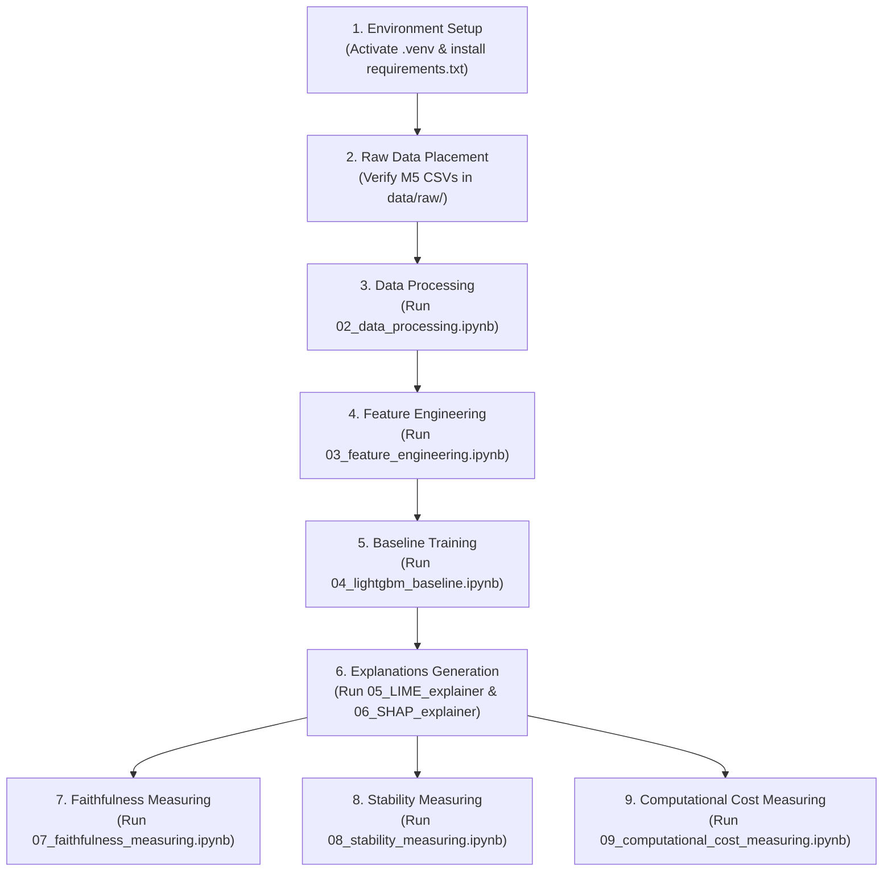

# Operational Runbook

## Overview

This runbook provides the operational step-by-step procedure for executing the **demand-forecast-xai** pipeline end-to-end, validating intermediate outputs, and troubleshooting common execution errors.

## Execution Sequence Overview



## Step-by-Step Execution Procedure

### Step 1: Environment Activation

Activate the virtual environment and ensure `notebooks/` is set as the working directory when launching Jupyter interface or scripts:

```powershell
# Windows
.\.venv\Scripts\Activate.ps1
jupyter notebook --notebook-dir=notebooks
```

### Step 2: Validate Raw Source Data

Confirm that the required M5 source files exist in `data/raw/`:
- `calendar.csv`
- `sell_prices.csv`
- `sales_train_evaluation.csv`

### Step 3: Run Data Processing

Open and execute `notebooks/02_data_processing.ipynb`.
- **Purpose**: Converts CSVs to Parquet dimension/fact tables in `data/processed/`.
- **Validation**: Verify that `fact_sales.parquet` (59,181,090 rows) and dimensional tables are written to `data/processed/`.

### Step 4: Run Feature Engineering

Open and execute `notebooks/03_feature_engineering.ipynb`.
- **Purpose**: Joins tables, filters store `CA_1`, and generates lags and rolling features.
- **Validation**: Verify that `data/features/features.parquet` exists (59,181,090 rows, 25 columns).

### Step 5: Run LightGBM Baseline Training

Open and execute `notebooks/04_lightgbm_baseline.ipynb`.
- **Purpose**: Trains LightGBM baseline on 22 features, runs recursive holdout forecasting post `2016-04-24`, and persists model artifacts.
- **Validation**: Check `experiments/exp_001_baseline_lgbm/artifacts/`:
  - `lightgbm_CA_1.pkl` created (~1.8 MB);
  - `predictions_CA_1.parquet` (85,372 rows);
  - `feature_importance_CA_1.parquet` (20 rows).

### Step 6: Run LIME & SHAP Explainers

Open and execute `notebooks/05_LIME_explainer.ipynb` and `notebooks/06_SHAP_explainer.ipynb`.
- **Purpose**: Generates local LIME and SHAP feature attributions for 200 error-tail instances.
- **Validation**:
  - `lime_explanations.parquet` (2,000 rows);
  - `shap_explanations.parquet` (4,400 rows);
  - `shap_metrics_CA_1.json` max reconstruction delta $< 10^{-8}$.

### Step 7: Run Faithfulness Measuring

Open and execute `notebooks/07_faithfulness_measuring.ipynb`.
- **Purpose**: Evaluates explanation fidelity via iterative feature ablation on high-error instances (`sample_bucket == 'bad'`).
- **Validation**:
  - `faithfulness_deletion_results.parquet` (2,200 rows);
  - `faithfulness_metric_curve.parquet` (22 rows);
  - `faithfulness_metrics.json` generated.

### Step 8: Run Stability Measuring

Open and execute `notebooks/08_stability_measuring.ipynb`.
- **Purpose**: Evaluates explanation robustness under 3% continuous Gaussian noise via Spearman rank correlation ($\rho$).
- **Validation**:
  - `stability_results.parquet` (200 rows);
  - `stability_metrics.json` generated.

### Step 9: Run Computational Cost Measuring

Open and execute `notebooks/09_computational_cost_measuring.ipynb`.
- **Purpose**: Measures wall-clock execution time (seconds) per instance for SHAP Local and LIME Local.
- **Validation**:
  - `computational_cost_results.parquet` (400 rows);
  - `computational_cost_metrics.json`;
  - `fig_computational_cost_comparison.png`.

## Troubleshooting Common Errors

### 1. `FileNotFoundError` during Notebook Execution
- **Cause**: Notebook launched from root directory instead of `notebooks/`.
- **Fix**: Launch Jupyter with `--notebook-dir=notebooks` or ensure `sys.path.insert(0, str(Path.cwd().parent))` is executed.

### 2. Memory Exhaustion / Out-of-Memory (OOM)
- **Cause**: Unpivoting `sales_train_evaluation.csv` into 59M rows in Notebook 02 requires high RAM.
- **Fix**: Ensure at least 16 GB RAM or close memory-intensive applications. `reduce_mem_usage()` is applied automatically to downcast types.

### 3. Missing Dependencies
- **Cause**: Packages missing from python environment.
- **Fix**: Re-run `pip install -r requirements.txt`.

## Related Documentation

- [Environment and Installation Guide](01_environment-and-installation.md)
- [Reproducibility Guide](02_reproducibility.md)
- [Artifact Catalog](03_artifact-catalog.md)
