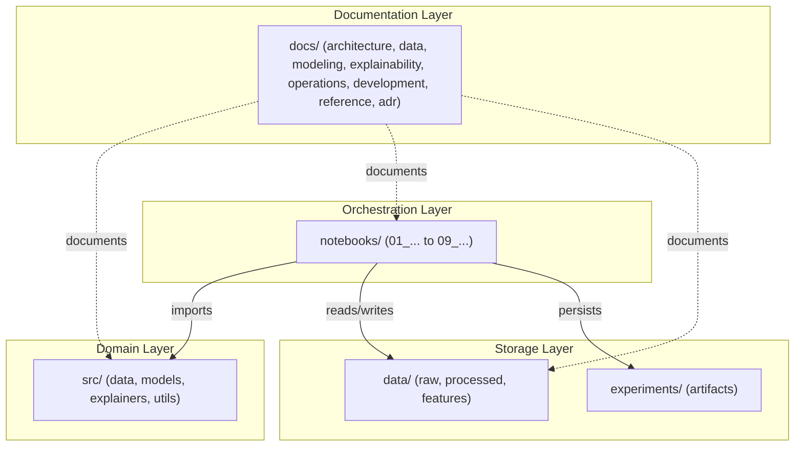

# Code Organization and Design Principles

## Overview

The **demand-forecast-xai** repository is structured around a clear separation of concerns between domain logic (`src/`), experiment orchestration (`notebooks/`), data storage (`data/`), experiment artifacts (`experiments/`), and technical documentation (`docs/`).

## Architectural Layers



## Principles of Design

### 1. Separation of Domain Logic and Orchestration
- **`src/`**: Contains pure, reusable, stateless Python functions and object-oriented contracts (`BaseModel`, `LightGBMModel`). No hardcoded notebook logic lives here.
- **`notebooks/`**: Serves as the interactive execution driver. Notebooks import functions from `src/`, define experiment parameters, display plots, and persist artifacts.

### 2. Layered Data Storage
- **`data/raw/`**: Read-only source CSV files.
- **`data/processed/`**: Intermediate Star Schema Parquet tables (`dim_calendar`, `dim_prices`, `fact_sales`, etc.).
- **`data/features/`**: Consolidated modeling dataset (`features.parquet`).

### 3. Experiment Isolation
- Output models, predictions, metrics, and explanations are saved under versioned experiment folders (`experiments/exp_001_baseline_lgbm/artifacts/`). This allows running new experiments without corrupting baseline results.

## Package Structure (`src/`)

```text
src/
├── data/
│   ├── loader.py              # I/O functions for CSV and Parquet datasets
│   ├── data_processing.py     # Memory reduction and dimensional transformations
│   └── feature_creation.py    # Merging, calendar, lag, and rolling features
├── models/
│   ├── base_model.py          # Abstract base class interface (BaseModel)
│   ├── lightgbm_model.py      # LightGBM implementation (LightGBMModel)
│   └── splitting.py           # Temporal train/holdout splitting and target separation
├── explainers/
│   ├── lime_explainer.py      # LIME tabular explainer and error-tail sampling
│   ├── shap_explainer.py      # SHAP TreeExplainer and additivity validation
│   ├── faithfulness.py        # Iterative deletion fidelity evaluation and metric curves
│   ├── stability.py           # Continuous noise perturbation and Spearman stability
│   └── computational_cost.py  # Wall-clock execution time benchmarking and timers
└── utils/
    ├── metrics.py             # Forecast metrics (RMSE, MAE, MAPE, RMSSE, WRMSSE)
    └── helpers.py             # Pickle serialization helpers
```

## Coding Conventions

- **Style**: PEP 8 compliance.
- **Path Handling**: Always use `pathlib.Path` instead of string concats for cross-platform OS compatibility (Windows/Linux).
- **Module Resolution**: Notebooks set `sys.path.insert(0, str(Path.cwd().parent))` to import `src/` modules cleanly.
- **Docstrings**: Functions in `src/` include Google-style docstrings detailing arguments, returns, and types.

## Related Documentation

- [Architecture Overview](../01_architecture/01_overview.md)
- [Module Dependencies](../01_architecture/03_module-dependencies.md)
- [Contribution Guide](03_contribution-guide.md)
