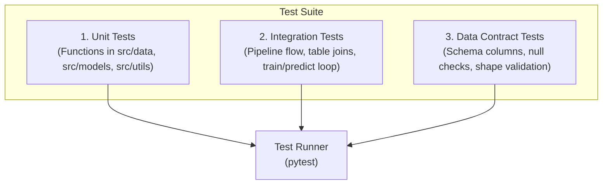

# Testing Strategy

## Overview

This document outlines the testing architecture, quality gates, and automated test cases designed to maintain code quality and data contract integrity across **demand-forecast-xai**.

## Testing Architecture



## Recommended Test Coverage Areas

### 1. Data Processing & Memory Reduction (`src/data/`)
- **`reduce_mem_usage(df)`**: Verify downcasting of integer/float types and memory savings without data loss.
- **Dimensional Transformers**: Ensure `process_dim_calendar` and `process_dim_location` return correct column names and unique keys.
- **`consolidate_processed(tables, store_filter)`**: Verify that filtering for `store_id == 'CA_1'` returns only target store rows and correct composite `id`.

### 2. Feature Creation (`src/data/feature_creation.py`)
- **Calendar Features**: Verify `day_of_month`, `day_of_week`, and `week_of_year` calculations against known dates.
- **Lag & Rolling Features**: Verify that `sales_lag_7` shifts values by exactly 7 periods per time-series `id`.

### 3. Model Interface & Splitting (`src/models/`)
- **`BaseModel` Contract**: Ensure new model implementations derive from `BaseModel` and implement `train`, `predict`, and `get_feature_importance`.
- **`LightGBMModel`**: Verify fitting on dummy DataFrame, predict shape, and non-empty feature importance DataFrame.
- **`splitting.py`**: Verify temporal cutoff separation without overlap and correct column filtering in `split_features_target()`.

### 4. Explainability & Sampling (`src/explainers/`)
- **`select_error_tail_sample`**: Test that the function returns exactly `sample_size` rows, containing equal parts `excellent` and `bad` buckets.
- **`encode_for_model`**: Confirm string/categorical columns are converted to integer codes.
- **SHAP Additivity**: Assert that $\sum \text{SHAP} + \text{expected\_value} \approx \text{model\_output}$ with $|\text{delta}| < 10^{-8}$.
- **Faithfulness (`faithfulness.py`)**: Verify that `compute_obfuscation_values()` returns medians for continuous and modes for categorical features, and that `run_iterative_deletion()` records step 0 through max_steps.
- **Stability (`stability.py`)**: Assert that `add_continuous_perturbation()` does not modify categorical variables and that non-negative bounds are maintained. Check `compute_ranking_stability()` returns Spearman $\rho \in [-1, 1]$.
- **Computational Cost (`computational_cost.py`)**: Assert `Timer` context manager and `timer` decorator return non-negative execution times in seconds.

## Executing Tests (Pytest)

Install testing dependencies:

```bash
pip install pytest pytest-cov
```

Run test suite:

```bash
pytest tests/ --cov=src/
```

## Quality Assurance Rules (Quality Gates)

All code modifications must satisfy:
1. **No Null Targets**: Training and holdout data must contain valid, numeric `sales` values.
2. **Schema Invariance**: Feature engineering output must maintain all 25 expected columns (and 22 model input features).
3. **Non-negative Predictions**: Model predictions for demand should be clipped or verified non-negative where applicable.

## Related Documentation

- [Code Organization](01_code-organization.md)
- [Feature Dataset Contract](../02_data/03_feature-contract.md)
