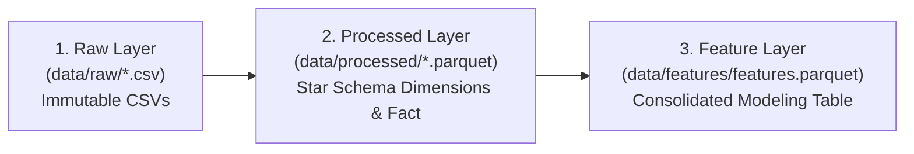

# ADR 001: Layered Parquet Data Model (Star Schema)

- **Status**: Accepted
- **Date**: 2026-07-26
- **Deciders**: Project Architecture Team
- **Technical Area**: Data Processing & Storage

## Context

The raw M5 Forecasting Accuracy dataset consists of large, wide-format CSV files. In particular, `sales_train_evaluation.csv` contains 30,490 series with 1,941 daily sales columns (`d_1` to `d_1941`).

Reading and unpivoting raw CSV files directly during feature engineering or model training is computationally expensive, memory-intensive, and slow. Furthermore, unversioned in-memory data transformations hinder data lineage traceability.

## Decision

We decided to implement a **three-layer data architecture** utilizing Apache Parquet as the primary storage format for intermediate and feature datasets:

1. **Raw Layer (`data/raw/`)**: Preserves immutable M5 source CSV files.
2. **Processed Layer (`data/processed/`)**: Converts CSVs into a lightweight Star Schema materialized as Parquet:
   - `dim_calendar.parquet`: Calendar attributes and event codes.
   - `dim_location.parquet`: Unique store and state pairs.
   - `dim_prices.parquet`: Weekly selling prices per store-item.
   - `bridge_snap.parquet`: State-specific SNAP indicators.
   - `fact_sales.parquet`: Unpivoted long-format unit sales (59,181,090 rows).
   - Numeric types are downcast (`int8`, `int16`, `float16`) to reduce memory.
3. **Feature Layer (`data/features/`)**: Consolidates processed tables for a target store (`CA_1`) into `features.parquet`, adding calendar, event, lag, and rolling statistics.

## Consequences

### Positive
- **Read Efficiency**: Parquet columnar format dramatically reduces file load times in notebooks.
- **Memory Optimization**: Type downcasting reduces in-memory footprint (e.g., sales dataframe memory reduced by up to 78.5%).
- **Lineage Clarity**: Explicit separation between dimensional tables and feature datasets.

### Negative / Trade-Offs
- **Disk Usage**: Materializing intermediate Parquet files requires additional local storage space.
- **High Memory during Melt**: Unpivoting 1,941 daily columns into 59M rows in `fact_sales.parquet` requires high RAM ($\ge 16\text{ GB}$) during Notebook 02 execution.

## Related Documentation

- [Architecture Overview](../01_architecture/01_overview.md)
- [Processed Data Schema](../02_data/02_processed-schema.md)
- [Notebook 02: Data Processing](../04_notebooks/02_data-processing.md)
