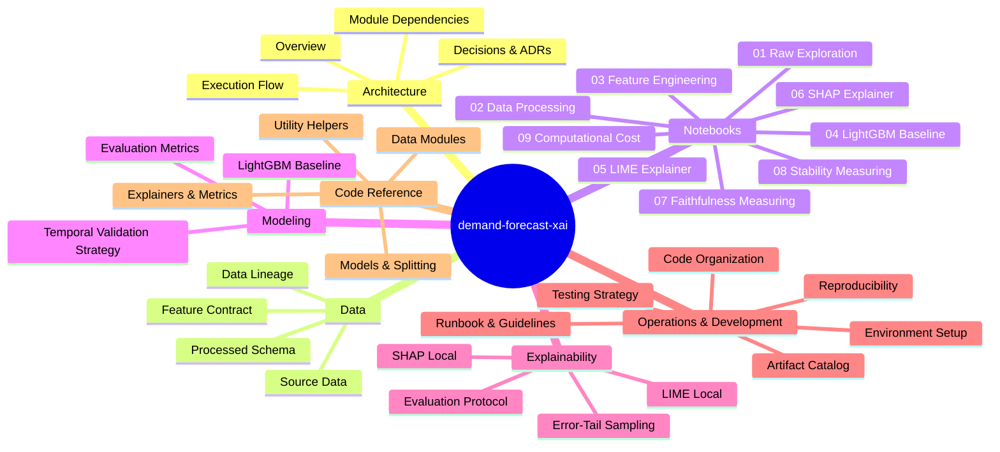

# Technical Documentation

Welcome to the technical documentation for **demand-forecast-xai**. This documentation provides a comprehensive architectural, data, modeling, explainability, and operational overview of the demand forecasting and explainable AI (xAI) codebase.

## Documentation Navigation

## Recommended Reading Order

1. **[01. Architecture](01_architecture/)**
   - [01 Overview](01_architecture/01_overview.md) | [02 Execution Flow](01_architecture/02_execution-flow.md) | [03 Module Dependencies](01_architecture/03_module-dependencies.md) | [04 Decisions](01_architecture/04_decisions.md)
2. **[02. Data](02_data/)**
   - [01 M5 Source Data](02_data/01_m5-source-data.md) | [02 Processed Schema](02_data/02_processed-schema.md) | [03 Feature Contract](02_data/03_feature-contract.md) | [04 Data Lineage](02_data/04_lineage.md)
3. **[04. Notebooks](04_notebooks/)**
   - [01 Raw Exploration](04_notebooks/01_raw-data-exploration.md) | [02 Data Processing](04_notebooks/02_data-processing.md) | [03 Feature Engineering](04_notebooks/03_feature-engineering.md) | [04 LightGBM Baseline](04_notebooks/04_lightgbm-baseline.md) | [05 LIME Explainer](04_notebooks/05_lime-explainer.md) | [06 SHAP Explainer](04_notebooks/06_shap-explainer.md) | [07 Faithfulness](04_notebooks/07_faithfulness-measuring.md) | [08 Stability](04_notebooks/08_stability-measuring.md) | [09 Computational Cost](04_notebooks/09_computational-cost-measuring.md)
4. **[05. Modeling](05_modeling/)**
   - [01 LightGBM Baseline Model](05_modeling/01_lightgbm-baseline.md) | [02 Temporal Validation Strategy](05_modeling/02_temporal-validation.md) | [03 Evaluation Metrics](05_modeling/03_metrics.md)
5. **[06. Explainability](06_explainability/)**
   - [01 LIME Local](06_explainability/01_lime.md) | [02 SHAP Local](06_explainability/02_shap.md) | [03 Error-Tail Sampling](06_explainability/03_sampling-by-error.md) | [04 Evaluation Protocol](06_explainability/04_evaluation-protocol.md)
6. **[07. Operations](07_operations/)**
   - [01 Environment & Installation](07_operations/01_environment-and-installation.md) | [02 Reproducibility Guide](07_operations/02_reproducibility.md) | [03 Artifact Catalog](07_operations/03_artifact-catalog.md) | [04 Operational Runbook](07_operations/04_runbook.md)
7. **[08. Development](08_development/)**
   - [01 Code Organization](08_development/01_code-organization.md) | [02 Testing Strategy](08_development/02_testing-strategy.md) | [03 Contribution Guide](08_development/03_contribution-guide.md)
8. **[09. Code Reference](09_reference/)**
   - [Reference Index](09_reference/index.md) | [Data Modules](09_reference/data/01_loader.md) | [Models & Splitting](09_reference/models/01_base-model.md) | [Explainers](09_reference/explainers/01_lime-explainer.md) | [Utils](09_reference/utils/01_metrics.md)
9. **[10. Architecture Decision Records (ADRs)](10_adr/)**
   - [ADR Index](10_adr/README.md) | [01 Data Model](10_adr/01_data-model.md) | [02 Temporal Split](10_adr/02_temporal-split.md) | [03 XAI Sampling Strategy](10_adr/03_xai-sampling-strategy.md)
